Комп'ютерні системи імітаційного моделювання  
СПм-24-3, Калашников Павло Андрійович  
Лабораторна робота №1. Опис імітаційних моделей та проведення обчислювальних експериментів  

Варіант 7, модель у середовищі NetLogo:  
**Wolf Sheep Predation**

---

## Вербальний опис моделі

Ця модель досліджує стабільність екосистем «хижак-жертва». Така система називається нестабільною, якщо вона призводить до вимирання одного або декількох видів, що входять до її складу. Навпаки, система є стабільною, якщо вона має тенденцію до самовідновлення з часом, незважаючи на коливання чисельності популяції.

---

## Керуючі параметри

- **initial-number-sheep** — початкова кількість овець.  
- **initial-number-wolves** — початкова кількість вовків.  
- **sheep-reproduce** — ймовірність розмноження овець (%).  
- **wolf-reproduce** — ймовірність розмноження вовків (%).  
- **grass-regrowth-time** — кількість тактів, необхідна для відновлення трави.  
- **sheep-gain-from-food** — енергія, що отримує вівця, поїдаючи траву.  
- **wolf-gain-from-food** — енергія, що отримує вовк, поїдаючи вівцю.

---

## Внутрішні параметри

- **energy** — рівень енергії агентів.  
- **pcolor, countdown** — параметри патчів (статус трави, час до відновлення).  
- **heading, position** — координати та напрям руху агентів.

---

## Показники роботи моделі

- кількість овець та вовків у часі;  
- середнє значення чисельності популяцій за обраний інтервал;  
- час до вимирання виду;  
- стабільність чи колапс системи.

---

## Недоліки моделі

- хижаки не переслідують жертв цілеспрямовано;  
- відсутність залежності розмноження від енергетичного стану;  
- система часто нестабільна у довгостроковій перспективі;  
- модель не враховує сезонності та складних екологічних взаємодій.

---

# Обчислювальні експерименти

Усі моделювання виконано до **300 ticks** або до повного вимирання популяцій.  
Початкові параметри (для більшості експериментів):  
100 овець, 50 вовків, sheep-reproduce = 4%, wolf-reproduce = 5%, grass-regrowth-time = 30.

---

# **1. Експеримент: вплив початкової кількості овець**

Мета: визначити, як стартова чисельність жертв впливає на виживання обох популяцій.

### Змінний параметр:
`initial-number-sheep = 50, 100, 150, 200`

---

## Зображення результатів:

### **initial-number-sheep = 50**
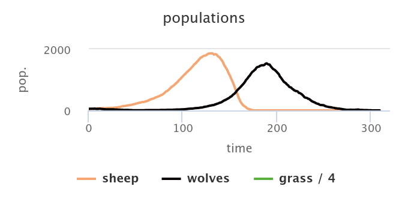

### **initial-number-sheep = 100**

### **initial-number-sheep = 150**
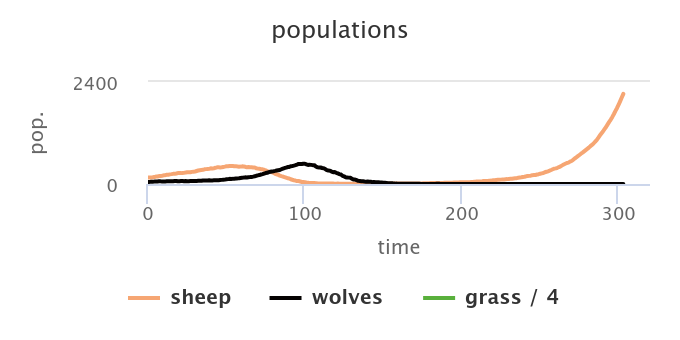

### **initial-number-sheep = 200**
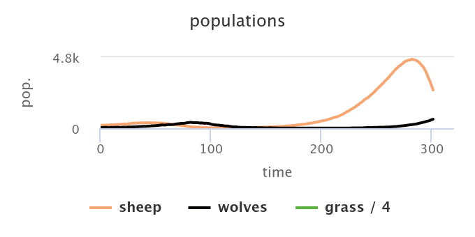

---

## Таблиця результатів

| initial-number-sheep | avg sheep | avg wolves | Динаміка |
|----------------------|-----------|------------|----------|
| **50** | 402.96 | 325.40 | Повне вимирання обох популяцій |
| **100** | 254.90 | 114.58 | Вовки вимерли, вівці різко зросли |
| **150** | 246.72 | 93.59 | Вовки вимерли, вівці стабільно зростали |
| **200** | 987.01 | 125.93 | Вовки вимерли, вівці перейшли до експоненційного росту |

---

## Висновок

Модель демонструє високу нестабільність: у всіх сценаріях вовки вимерли, а вівці або вимерли разом із ними (50), або переходили до експоненційного росту (100+).

---

# **2. Експеримент: вплив швидкості відновлення трави**

Мета: з’ясувати, як ресурсна база впливає на стійкість моделі.

### Змінний параметр:
`grass-regrowth-time = 10, 20, 30, 40`

---

## Зображення результатів:

### grass = 10
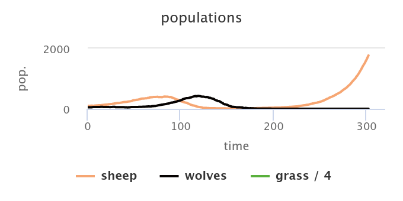

### grass = 20
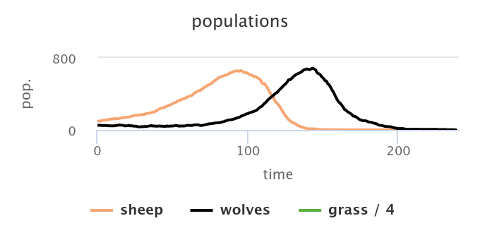

### grass = 30
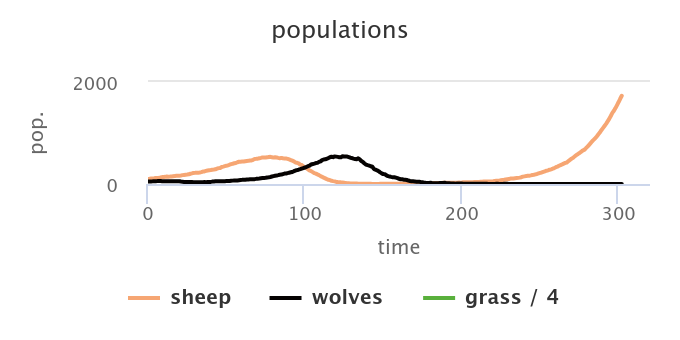

### grass = 40
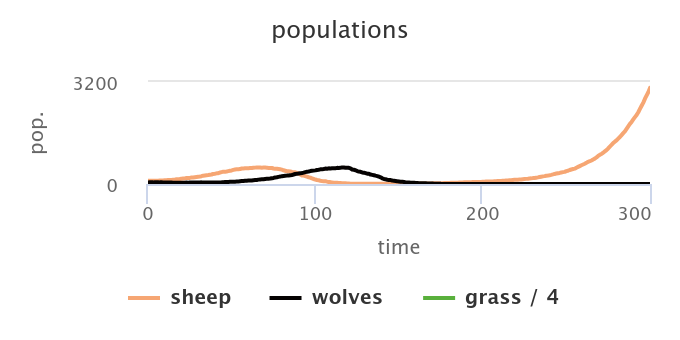

---

## Таблиця

| grass-regrowth-time | avg sheep | avg wolves | Динаміка |
|---------------------|-----------|------------|----------|
| **10** | 238.53 | 91.23 | Вовки вимерли, вівці виросли |
| **20** | 190.97 | 164.65 | Повний колапс: обидві популяції вимерли |
| **30** | 254.90 | 114.58 | Вовки вимерли, вівці стабільно зростали |
| **40** | 359.12 | 106.11 | Вовки вимерли, вівці різко зросли |

---

## Висновок

Параметр відновлення трави критично впливає на стабільність.  
**grass = 20** призводить до дефіциту ресурсу → зникнення овець → голодування вовків → повного колапсу системи.  
У режимах 10, 30, 40 ресурс стає достатнім для виживання овець, але вовки все одно вимерли.

---

# **3. Експеримент: вплив імовірності розмноження вовків**

Мета: оцінити, як інтенсивність відтворення хижаків впливає на існування обох видів.

### Змінний параметр:
`wolf-reproduce = 1%, 3%, 5%, 7%`

---

## Зображення результатів:

### reproduce = 1%
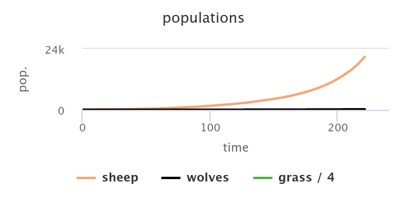

### reproduce = 3%
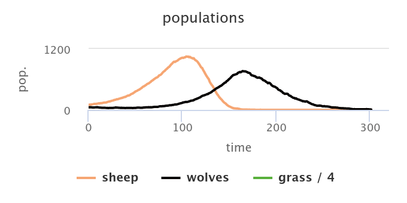

### reproduce = 5%
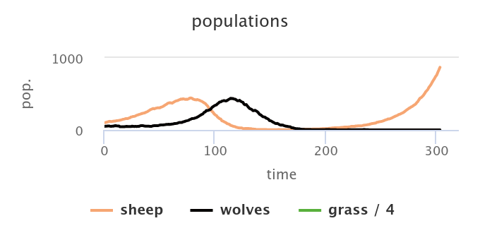

### reproduce = 7%
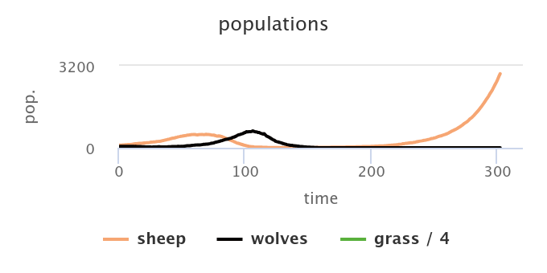

---

## Таблиця

| wolf-reproduce | avg sheep | avg wolves | Динаміка |
|----------------|-----------|------------|----------|
| **1%** | 4138.20 | 94.60 | Вовки швидко вимерли, вівці експоненційно зросли |
| **3%** | 255.62 | 220.25 | Вівці вимерли, вовки вимерли пізніше → повний колапс |
| **5%** | 169.60 | 94.45 | Вовки вимерли, вівці виросли |
| **7%** | 332.93 | 99.76 | Вовки вимерли, вівці виросли |

---

## Висновок

Модель демонструє сильну чутливість до параметра `wolf-reproduce`.  
Нижчі значення (1%) не дозволяють вовкам вижити.  
При 3% вовки здатні знищити овець, але не можуть існувати без них — система колапсує.  
При 5–7% сценарій повторюється: вовки вимерли, вівці зростають.

---

# Загальний висновок

Модель **Wolf Sheep Predation** є нестійкою в базових умовах.  
У більшості експериментів:

- вовки вимерли;  
- вівці або вимерли разом із ними, або переходили у експоненційний ріст;  
- стабільної рівноваги досягти не вдалося.

Модель добре демонструє класичні проблеми систем хижак–жертва та потребу в більш складній поведінці агентів або регулятивних механізмах.

