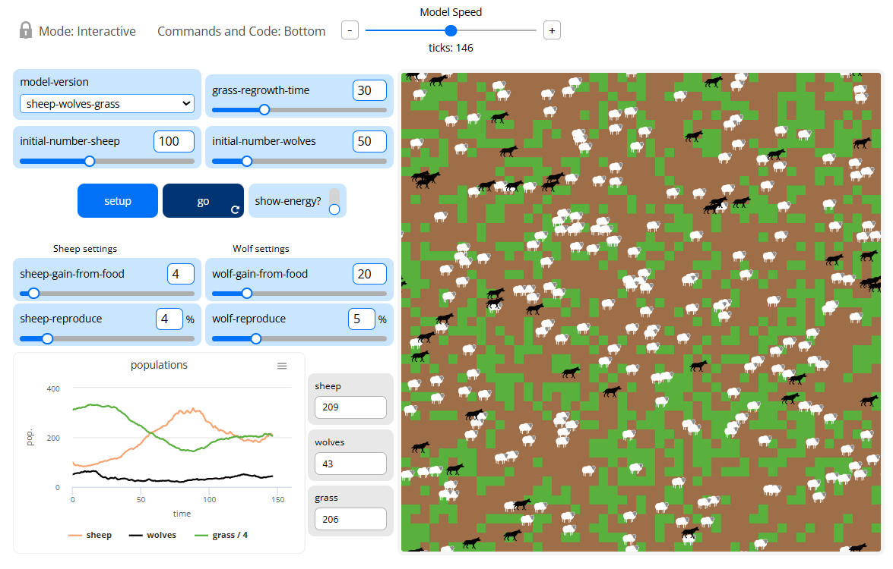
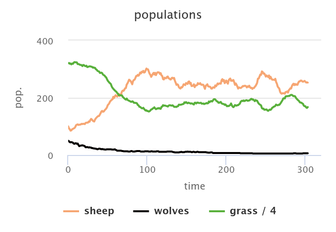
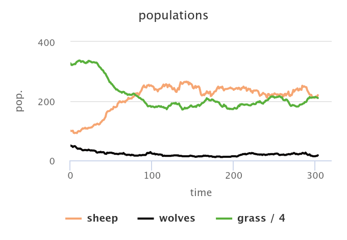
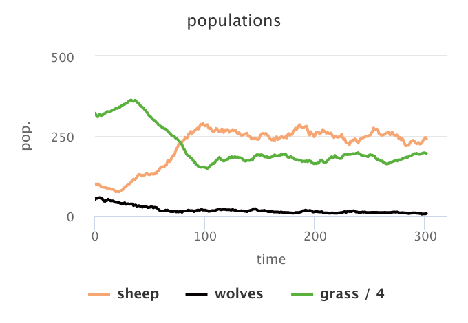
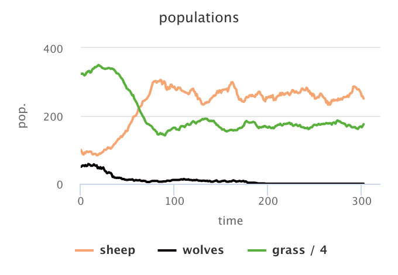

Комп'ютерні системи імітаційного моделювання  
СПм-24-3, Калашников Павло  
Лабораторна робота №2. Редагування імітаційних моделей у середовищі NetLogo  

Варіант 7, модель у середовищі NetLogo:  
Wolf Sheep Predation


## Вербальний опис моделі

Ця модель досліджує стабільність екосистем «хижак-жертва». Така система називається нестабільною, якщо вона призводить до вимирання одного або декількох видів, що входять до її складу. Навпаки, система є стабільною, якщо вона має тенденцію до самовідновлення з часом, незважаючи на коливання чисельності популяції.

## Керуючі параметри

- **initial-number-sheep** — початкова кількість овець.  
- **initial-number-wolves** — початкова кількість вовків.  
- **sheep-reproduce** — ймовірність розмноження однієї вівці (%).  
- **wolf-reproduce** — ймовірність розмноження вовка (%).  
- **grass-regrowth-time** — час відростання трави (у версії з травою).  
- **model-version** — перемикач між моделями «просто вовки-вівці» та «вовки-вівці-трава».


## Внутрішні параметри

- **max-sheep**  
- **sheep a-sheep**  
- **wolves wolf**
- **energy**
- **countdown**


## Показники роботи моделі

- чисельність популяції вовків;  
- чисельність популяції овець;  
- наявність трави (зелений pcolor) у моделі з травою;  
- характер коливань популяцій на часовому графіку.


---

У цьому розділі наведено ті фрагменти коду, які були змінені або додані під час виконання лабораторної роботи. Повний код модифікованої моделі розміщений у файлі `wolf_sheep_modified.nlogo` у папці `lab2/`.

# 1. Внесені зміни у вихідну логіку моделі

### Перелік змінених та доданих процедур

- `choose-direction` — нова процедура пошуку напряму руху вовка  
- `move` — змінена логіка руху для вовків та овець  
- `wolf-collision-check` — нова процедура усунення колізій між вовками  
- доданий блок уникнення вовків у логіці руху овець  
- доданий штраф енергії при втечі

### **1) Прибрати «зграйність» вовків**  
У базовій моделі вовки рухаються випадково.  
Згідно варіанту — вовк повинен «оглядатися» навколо та обирати напрямок руху залежно від:

- наявності овець поблизу;  
- відсутності інших вовків поблизу;  
- інакше — рухатися випадково.

**Додано процедуру пошуку напрямку:**

```netlogo
to choose-direction  ;; wolf procedure
  let nearby-sheep sheep in-radius 3
  let nearby-wolves other wolves in-radius 1

  if any? nearby-sheep [
    facex one-of nearby-sheep
    stop
  ]

  if any? nearby-wolves [
    rt 180
    stop
  ]

  rt random 50
  lt random 50
end
```

### **2) Зміна поведінки вовків у процедурі move**

```netlogo
to move  ;; wolf procedure (modified)
  if breed = wolves [
    choose-direction
    fd 1
    stop
  ]

  ;; default movement for sheep:
  rt random 50
  lt random 50
  fd 1
end
```
### **3) Якщо два вовки опиняються на одній клітині — залишається один**

```netlogo
to wolf-collision-check  ;; wolf procedure
  let rivals other wolves-here
  if any? rivals [
    ask one-of rivals [ die ]
  ]
end
```
### Викликається післч руху:

```netlogo
ask wolves [
  move
  wolf-collision-check
  ...
]
```
### **4) Вівці тікають від вовків**

```netlogo
if breed = sheep [
  let danger one-of wolves in-radius 2
  if danger != nobody [
    facex danger
    rt 180
    fd 1
    stop
  ]
]
```

Таким чином вівці змінюють напрям на протилежний при виявленні хижака.

# 2. Внесені зміни у вихідну логіку моделі (За власною ініціативою)
Додано невелике покращення: вівці отримують штраф енергії за спробу втечі, що робить модель більш реалістичною.

```netlogo
if breed = sheep [
  let danger one-of wolves in-radius 2
  if danger != nobody [
    set energy energy - 1
  ]
]
```
Це призводить до швидшого вимирання овець при великій чисельності вовків.

## 3. Скрин моделі в процесі симуляції

Нижче наведено приклад вигляду моделі під час роботи симуляції:




---

## 4. Обчислювальний експеримент

### Мета
Дослідити вплив параметра **wolf-reproduce (%)** на середні популяції вовків та овець у модифікованій моделі Wolf Sheep Predation.

### Початкові умови експерименту
- **initial-number-sheep:** 100  
- **initial-number-wolves:** 50  
- **sheep-reproduce:** 4%  
- **model-version:** sheep-wolves
- **Тривалість симуляції:** 300 ticks  
- **Інші параметри:** значення за замовчуванням  
- Для кожного значення wolf-reproduce модель запускалась один раз, а середні значення брались з експортованого CSV.

---

### Результати експерименту

#### **1) wolf-reproduce = 1%**


| Показник | Значення |
|---------|----------|
| Середня кількість овець | 228.39 |
| Середня кількість вовків | 12.63 |

---

#### **2) wolf-reproduce = 3%**


| Показник | Значення |
|---------|----------|
| Середня кількість овець | 213.54 |
| Середня кількість вовків | 20.69 |

---

#### **3) wolf-reproduce = 5%**


| Показник | Значення |
|---------|----------|
| Середня кількість овець | 219.96 |
| Середня кількість вовків | 18.02 |

---

#### **4) wolf-reproduce = 7%**


| Показник | Значення |
|---------|----------|
| Середня кількість овець | 235.30 |
| Середня кількість вовків | 10.06 |

---

### Висновки експерименту

- Збільшення параметра **wolf-reproduce** не призводить до відповідного збільшення кількості вовків.  
- Максимальна середня чисельність вовків спостерігається при значенні 3%.  
- При 5–7% в екосистемі виникає конкуренція між хижаками, а вівці частіше уникають вовків, що знижує ефективність полювання.  
- Система демонструє нелінійний характер реагування на зміну параметра розмноження хижаків.

## 5. Аналіз результатів

Отримані значення середніх популяцій демонструють, що вплив параметра **wolf-reproduce (%)** на модель є нелінійним і залежить від поведінки хижаків у модифікованій версії моделі.

Основні спостереження:

1. **Низькі значення (1–3%) забезпечують найбільш стабільний стан популяцій.**  
   - При 1% популяція вовків майже вичерпується, оскільки вони розмножуються занадто повільно, щоб компенсувати втрати.  
   - При 3% чисельність вовків максимальна серед тестованих значень, що робить це значення оптимальним для підтримки балансу.

2. **При 5–7% популяція вовків зменшується, хоча ймовірність розмноження зростає.**  
   Це відбувається через особливості зміненої логіки:
   - вовки активно шукають овець, але також уникають інших вовків;
   - при зустрічі двох вовків один із них гине, що створює втрати всередині популяції;
   - вівці тікають ефективніше, тому вовки отримують менше енергії від полювання.

3. **Популяція овець залишається відносно стабільною**, навіть при високих значеннях параметра.  
   Це пояснюється тим, що модифікована логіка надає вівцям ефективні механізми уникнення хижаків.

4. **Система демонструє складну динаміку взаємодії**, в якій:
   - надто низька ймовірність розмноження веде до вимирання вовків;
   - надто висока — до надлишкової конкуренції між ними;
   - середні значення параметра дають найбільш збалансований результат.

Таким чином, результати показують, що поведінкова логіка агентів у моделі впливає на довгострокову динаміку не менше, ніж чисельні параметри. У цій модифікації оптимальною для вовків виявилася ймовірність розмноження **≈3%**, тоді як подальше збільшення лише погіршує їхню здатність підтримувати стабільну чисельність.

## 6. Загальний висновок

У даній лабораторній роботі була модифікована модель Wolf Sheep Predation відповідно до вимог варіанту та доповнена змінами на власний розсуд.  
Було реалізовано змінену поведінку вовків із пошуком цілей, уникненням інших вовків та врахуванням колізій. Також модифіковано поведінку овець, що дозволило їм ефективніше уникати хижаків.  

Проведений експеримент показав, що параметр `wolf-reproduce` має нелінійний вплив на стабільність популяцій. Найкращий баланс чисельності хижаків та жертв спостерігається при значенні близько 3%.  

Робота дозволила закріпити навички редагування моделей NetLogo, роботи з процедурною логікою, зміни поведінки агентів та проведення обчислювальних експериментів з подальшим аналізом.

