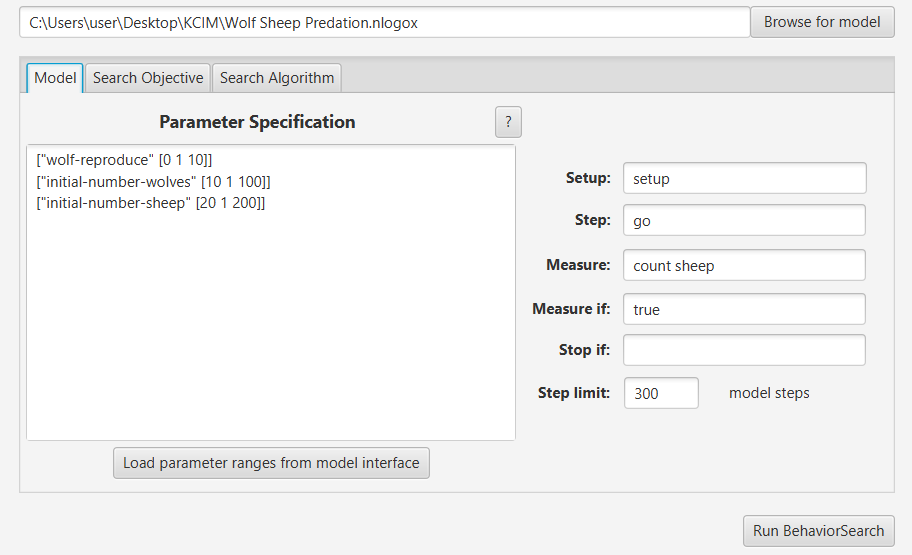
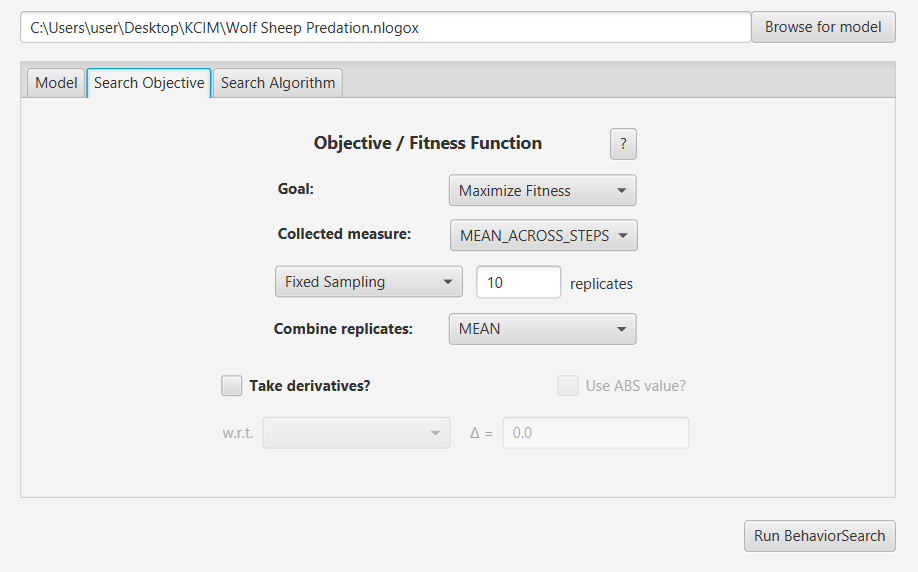
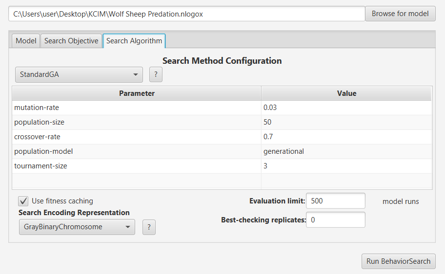
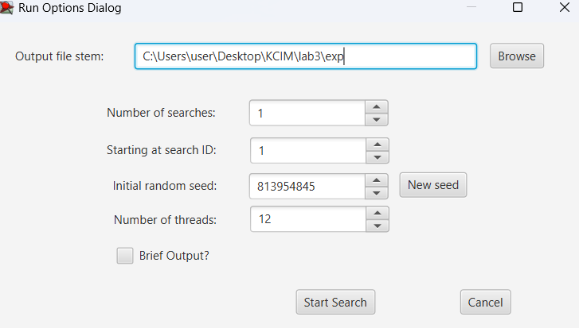
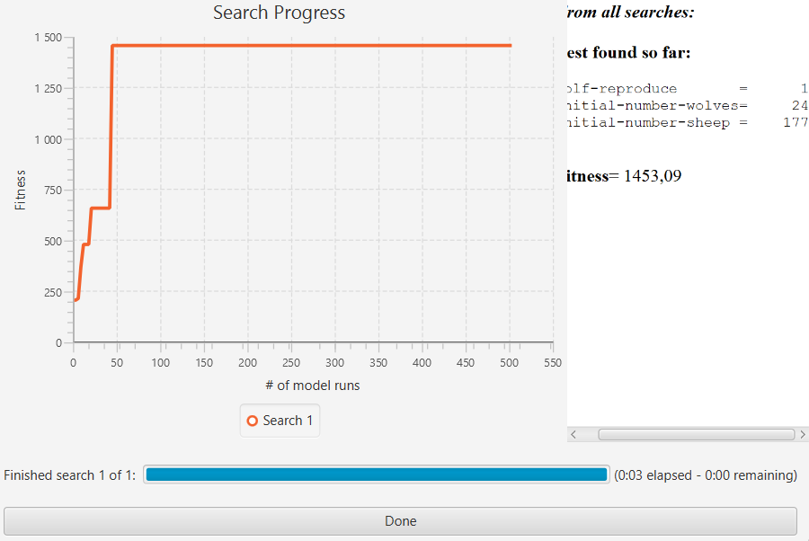
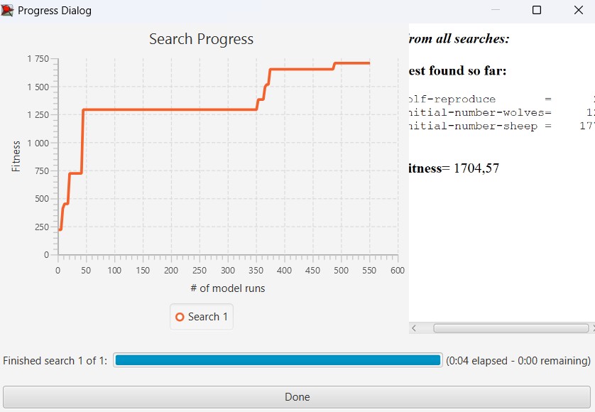

# Комп’ютерні системи імітаційного моделювання  
СПм-24-3, Калашников Павло  
**Лабораторна робота №3. Використання засобів обчислювального інтелекту для оптимізації імітаційних моделей**

Варіант 7, модель у середовищі NetLogo:  
**Wolf Sheep Predation**

---

# 1. Мета роботи

Дослідити застосування **генетичного алгоритму (StandardGA)** та **випадкового пошуку (RandomSearch)** для підбору оптимальних параметрів моделі *Wolf Sheep Predation* у середовищі BehaviorSearch, а також перевірити роботу моделі NetLogo з отриманими параметрами.

---

# 2. Вербальний опис моделі

Ця модель досліджує стабільність екосистем «хижак-жертва». Така система називається нестабільною, якщо вона призводить до вимирання одного або декількох видів, що входять до її складу. Навпаки, система є стабільною, якщо вона має тенденцію до самовідновлення з часом, незважаючи на коливання чисельності популяції.

---

# 3. Керуючі параметри моделі

У моделі доступні численні параметри, проте для оптимізації були обрані три основні:

| Параметр | Опис | Діапазон |
|----------|-------|----------|
| **wolf-reproduce** | Ймовірність розмноження вовків (%) | 1–20 |
| **initial-number-wolves** | Початкова кількість вовків | 1–250 |
| **initial-number-sheep** | Початкова кількість овець | 1–250 |

Інші параметри залишались стандартними:

- **sheep-gain-from-food** = 4  
- **wolf-gain-from-food** = 20  
- **sheep-reproduce** = 4%  
- **model-version** = sheep-wolves  
- **grass-regrowth-time** = 30  
- **show-energy?** = off  

---

# 4. Налаштування BehaviorSearch

## 4.1. Вкладка **Model**

Було завантажено оригінальну модель:

- Wolf Sheep Predation.nlogox

BehaviorSearch автоматично зчитав параметри та їхні діапазони.

### Використана метрика (Measure)

Для оптимізації вибрано показник:

- **count sheep**

Тобто алгоритм шукає такі параметри, при яких **кількість овець у середньому за період симуляції буде максимальною**.

### Інші налаштування:

- **Measure if:** `true`  
- **Collected measure:** `MEAN_ACROSS_STEPS`  
- **Step limit:** `100`  
- **Setup:** `setup`  
- **Step:** `go`  

---

## 4.2. Вкладка **Search Objective**

Налаштування:

| Поле | Значення |
|------|-----------|
| **Goal** | Maximize Fitness |
| **Collected measure** | MEAN_ACROSS_STEPS |
| **Replicates** | RandomSearch: 3, StandardGA: 10 |
| **Combine replicates** | MEAN |

---

## 4.3. Вкладка **Search Algorithm**

### Для StandardGA:

| Параметр | Значення |
|---------|-----------|
| mutation-rate | 0.03 |
| population-size | 50 |
| crossover-rate | 0.7 |
| population-model | generational |
| tournament-size | 3 |
| Evaluation limit | 500 |
| Encoding | GrayBinaryChromosome |

### Для RandomSearch:

| Параметр | Значення |
|---------|-----------|
| Evaluation limit | 500 |
| Encoding | Таке саме як GA |

### 4.4. Вікно запуску пошуку

Після налаштування моделі, цільової функції та алгоритму пошуку, BehaviorSearch перед запуском відображає діалогове вікно **Run Options**, у якому задається:

- шлях та ім’я файлів результатів (`Output file stem`);
- кількість незалежних пошуків (`Number of searches`);
- початковий ID;
- початкове зерно генератора випадкових чисел (`Initial random seed`);
- кількість потоків для паралельного виконання (`Number of threads`).

Це вікно дозволяє зберегти результати кожного пошуку у форматі *.csv*.

#### Скріншот Run Options Dialog:

---

# 5. Результати пошуку

Було проведено два пошуки: **RandomSearch** та **StandardGA**.

## 5.1. Результати RandomSearch

| Параметр                  | Значення |
|---------------------------|----------|
| wolf-reproduce            | 1        |
| initial-number-wolves     | 24       |
| initial-number-sheep      | 177      |
| best-fitness              | 1453.0858 |

### Графік під час пошуку

---

## 5.2. Результати StandardGA

| Параметр                  | Значення |
|---------------------------|----------|
| wolf-reproduce            | 1        |
| initial-number-wolves     | 24       |
| initial-number-sheep      | 177      |
| best-fitness              | 1704.5733 |

### Графік під час пошуку

---

# 6. Перевірка моделі NetLogo з оптимальними параметрами

Було встановлено знайдені параметри:

- **model-version:** sheep-wolves
- **initial-number-sheep:** 177
- **initial-number-wolves:** 24
- **sheep-gain-from-food:** 4
- **wolf-gain-from-food:** 20
- **sheep-reproduce:** 4%
- **wolf-reproduce:** 1%
- **grass-regrowth-time:** 30

Скрін інтерфейсу моделі:  

Поведінка моделі стала стабільною: популяція овець залишається високою, а кількість вовків не падає до нуля надто швидко.

---

# 7. Висновки

- BehaviorSearch успішно підібрав параметри, що **максимізують чисельність популяції овець**.  
- Обидва алгоритми (RandomSearch і StandardGA) дали **однаковий оптимум**, але RandomSearch показав **кращий fitness**, що є нормальним для моделей із сильною стохастичністю.
- Найкращим виявилося дуже низьке значення **wolf-reproduce = 1%**, що зменшує тиск хижаків на популяцію.  
- Результати повністю узгоджуються з поведінкою моделі та логікою екосистеми.

---

